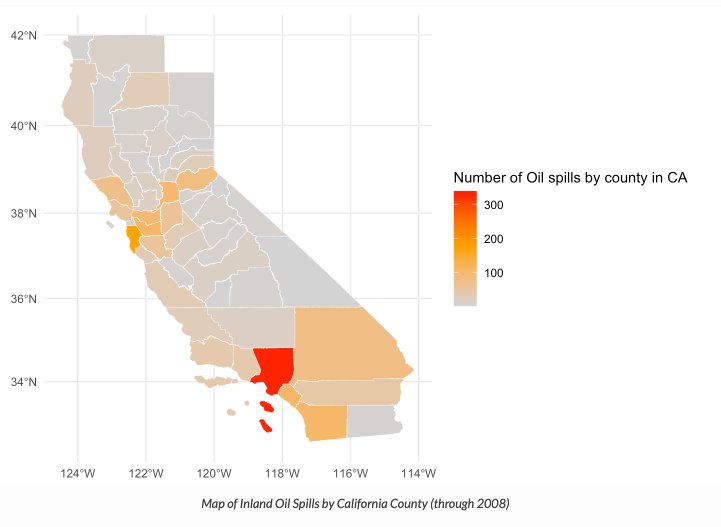
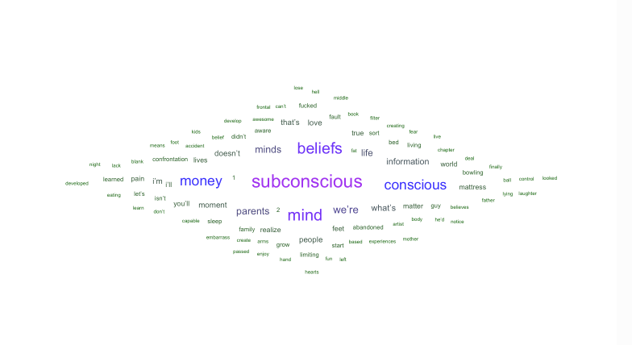
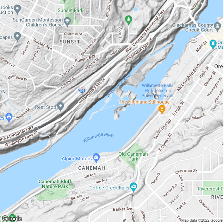
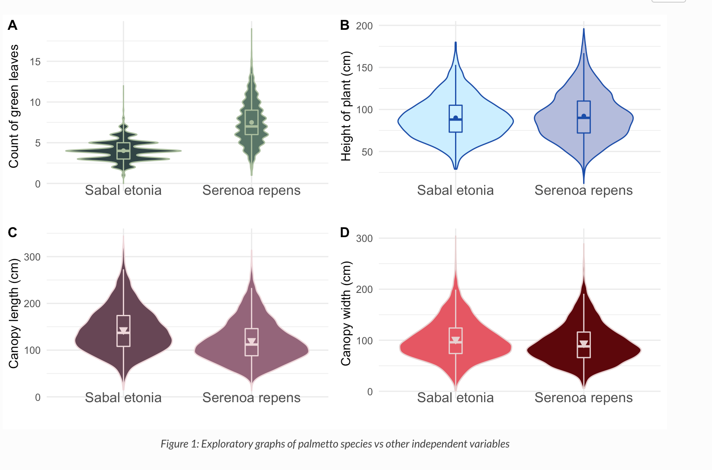
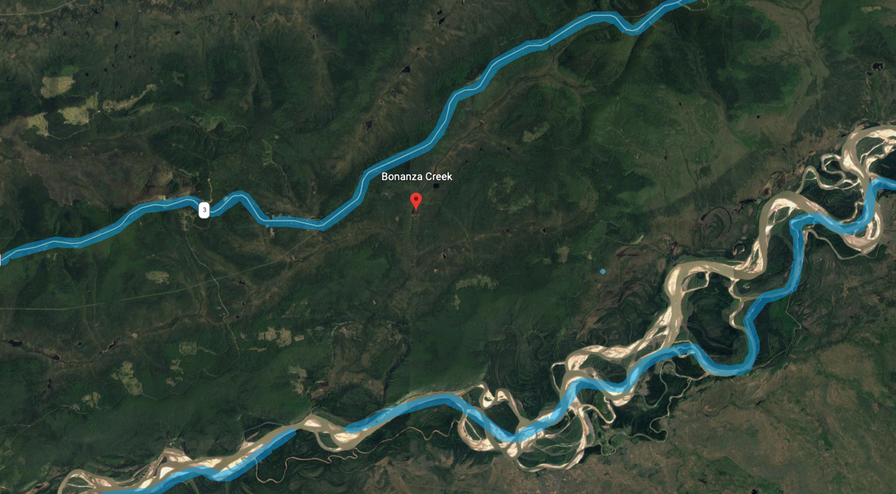

<html>
  
<body>
<section class="projects" id="projects">
<h2 class="projects-title"> Recent Projects</h2>

<section class="projects" id="projects">
<h2 class="projects-title"> Older Projects</h2>

<h3>
    <a
      href="projects/ca_oil_spill_2008.html"
      target="_blank"
      class="btn project-title">
      California Oil Spill (2008)
    </a>
</h3>

<h3>
    <a
      href="projects/sentiment_analysis.html"
      target="_blank"
      class="btn project-title">
      Sentiment Analysis
    </a>
</h3>

<h3>
    <a
      href="projects/fish_passage.html"
      target="_blank"
      class="btn project-title">
      Willamette Falls Fish Passage
    </a>
</h3>

<h3>
    <a
      href="projects/binary_logistic_regression.html"
      target="_blank"
      class="btn project-title">
      Binary Logistic Analysis
    </a>
</h3>

<h3>
    <a
      href="projects/narjes_mathlouthi_snowshoe_report.html"
      target="_blank"
      class="btn project-title">
      Juvenile Snowhare Count
    </a>
</h3>

</section>
</html>
  
</body>
