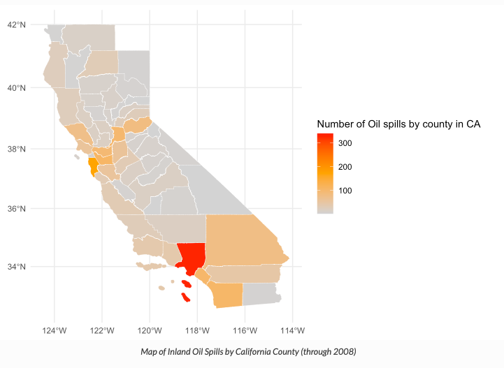
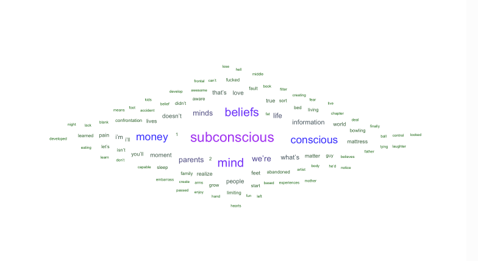
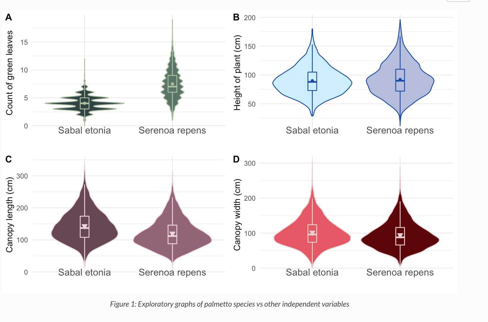
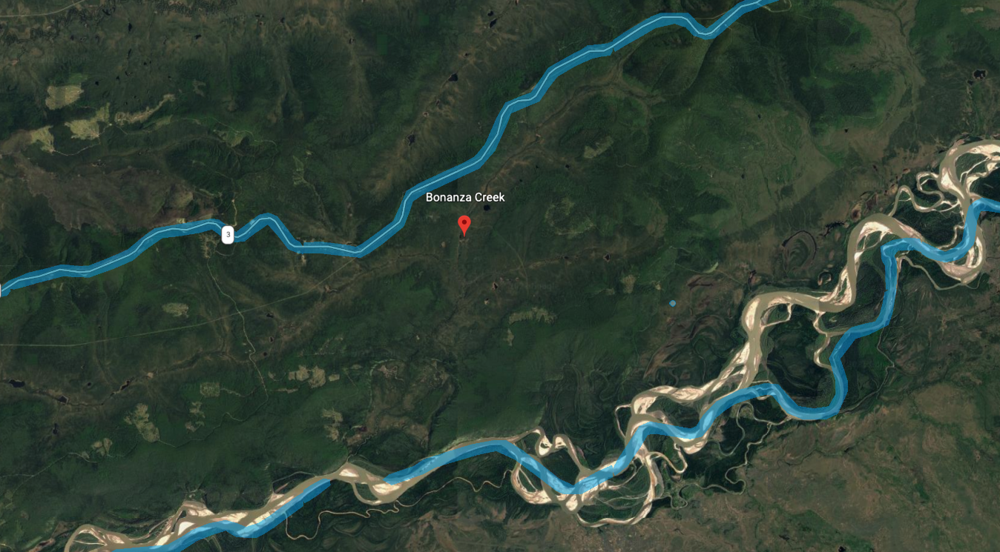
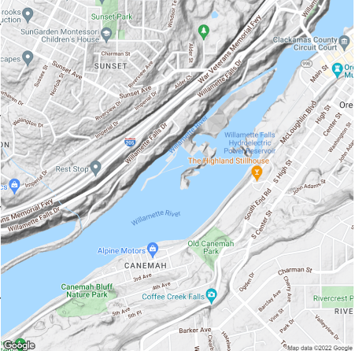

::: {=html}

Current

  <article class="project-card">
    <h3>
      <a
        href="https://narjesmath.github.io/pstat262DM/"
        target="_blank"
        rel="noopener"
        class="btn project-title"
      >
        Conditional Diffusion Models for Climate Downscaling and Bias Correction
      </a>
    </h3>
    

      Interactive presentation summarizing and critiquing Aich et al. on conditional diffusion models for climate-model precipitation downscaling and bias correction.
    

    <a
      href="https://narjesmath.github.io/pstat262DM/"
      target="_blank"
      rel="noopener"
      class="project-cta"
    >
      View Presentation <i class="fa fa-external-link-alt"></i>
    </a>
  </article>

Older Projects

  <article class="project-card">
    <h3>
      <a
        href="projects/ca_oil_spill_2008.html"
        target="_blank"
        class="btn project-title"
      >
        California Oil Spill (2008)
      </a>
    </h3>
    
  </article>

  <article class="project-card">
    <h3>
      <a
        href="projects/sentiment_analysis.html"
        target="_blank"
        class="btn project-title"
      >
        Sentiment Analysis
      </a>
    </h3>
    
  </article>
  <article class="project-card">
    <h3>
      <a
        href="projects/binary_logistic_regression.html"
        target="_blank"
        class="btn project-title"
      >
        Binary Logistic Analysis
      </a>
    </h3>
    
  </article>

  <article class="project-card">
    <h3>
      <a
        href="projects/narjes_mathlouthi_snowshoe_report.html"
        target="_blank"
        class="btn project-title"
      >
        Juvenile Snowhare Count
      </a>
    </h3>
    
  </article>
  
<article class="project-card">
    <h3>
      <a
        href="projects/fish_passage.html"
        target="_blank"
        class="btn project-title"
      >
        Willamette Falls Fish Passage
      </a>
    </h3>
    
  </article>
  

:::

<footer style="text-align: center; margin-top: 40px; padding: 20px; font-size: 0.85em; color: #666;">
  

  <!-- Social Media Icons -->
  <a href="mailto:nmathlouthi@ucsb.edu" title="Email"><i class="fas fa-envelope"></i></a> &nbsp;
  <a href="https://github.com/narjesmath" target="_blank" title="GitHub"><i class="fab fa-github"></i></a> &nbsp;
  <a href="https://www.linkedin.com/in/narjes-m" target="_blank" title="LinkedIn"><i class="fab fa-linkedin"></i></a> &nbsp;
  <a href="https://narjesmathlouthi.com" target="_blank" title="Website"><i class="fas fa-globe"></i></a>

  <!-- Copyright and Last Updated -->
  © 2022 – 2026 Narjes Mathlouthi. All rights reserved.  
  <em>Last updated: April 2026</em>  

  <!-- Back to Top Button -->
  <a href="#" style="
    background-color: #004F90;
    color: white;
    padding: 6px 12px;
    border-radius: 5px;
    text-decoration: none;
    font-weight: bold;
    font-size: 0.8em;
  ">
    ↑ Back to Top
  </a>
</footer>

